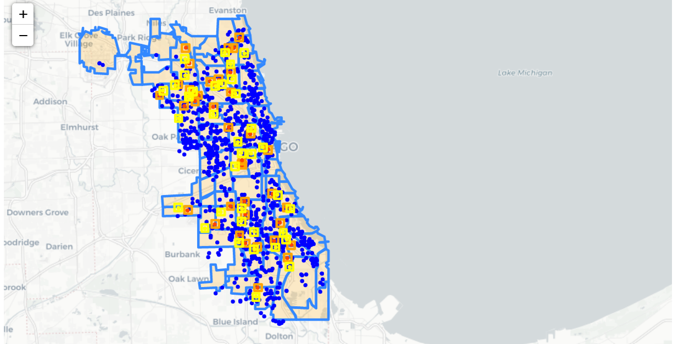

# Estimating the Causal Effect of Liquor Establishments on Crime in Chicago

## File summaries

- Final Project.docx: Written report of the analysis. Links to relevant original datasets are provided.
- DataAnalysis.ipynb: Main data analysis to fit models to data, find ATE and do sensitivity analysis
- clean_data_and_plot.ipynb: Cleans the data to create liquor establishment datasets. Also plots several interesting maps and graphs.
- clean_grocery_data.ipynb: Cleans the data to create grocery store datasets.
- cleaned_xxxx_data.csv files: Data files to be run with DataAnalysis.ipynb
- ATE Stats.xlsv: Some saved ATE values and feature importances
